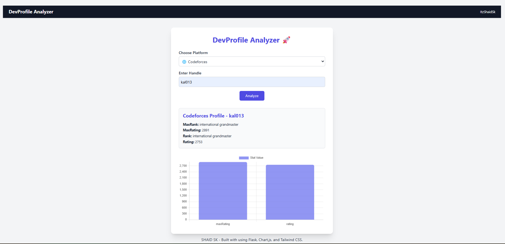

# 🚀 DevProfile Analyzer

**DevProfile Analyzer** is a web application that allows users to enter their competitive programming handles for **Codeforces**, **CodeChef**, and **AtCoder** and view profile statistics in a clean, visual format using charts.

## 📸 Preview

![screenshot]
  
*Simple form + bar chart showing rating stats*

## 🛠 Tech Stack

- ⚙️ **Backend**: Python, Flask
- 🎯 **Scraping/APIs**:
  - Codeforces API
  - CodeChef Web Scraping (BeautifulSoup)
  - AtCoder Web Scraping (BeautifulSoup)
- 📊 **Frontend**: HTML, Tailwind CSS, JavaScript, Chart.js

## 🌐 Supported Platforms

| Platform    | Method        | Data Fetched                          |
|-------------|---------------|---------------------------------------|
| Codeforces  | Official API  | Rating, Rank, Max Rating, Max Rank    |
| CodeChef    | Web Scraping  | Rating, Stars                         |
| AtCoder     | Web Scraping  | Rating, Highest Rating, Rank          |

## ⚙️ How It Works

1. User selects a platform and enters their handle.
2. Flask sends the data to `/analyze` endpoint.
3. The server fetches data using an API or scrapes the site.
4. A JSON response is sent back to the browser.
5. Chart.js dynamically visualizes the data.

## 📁 Project Structure

```cpp

devprofile-analyzer/
│
├── app.py                # Flask backend logic
├── requirements.txt      # Dependencies
├── templates/
│   └── index.html        # Web page with form & chart
├── static/               # Optional static assets

````

## 🚀 Getting Started

### 1. Clone the Repository

```bash
git clone https://github.com/your-username/devprofile-analyzer.git
cd devprofile-analyzer
````

### 2. Install Dependencies

```bash
pip install -r requirements.txt
```

### 3. Run the App

```bash
python app.py
```

Then open [http://127.0.0.1:5000](http://127.0.0.1:5000) in your browser.

---

## 📦 Example Inputs

- Codeforces: `tourist`
- CodeChef: `gennady.korotkevich`
- AtCoder: `tourist`

---

## 📌 Screenshots

>   

---

## 🧠 Possible Enhancements

- 🔐 API key management for private APIs
- 📈 Historical rating charts
- 🌑 Dark mode
- 🌍 Multi-language support

---

## 🤝 Contributing

Contributions, issues and feature requests are welcome!
Feel free to [open an issue](https://github.com/your-username/devprofile-analyzer/issues) or submit a PR.

---

## 📝 License

This project is licensed under the [MIT License](LICENSE).

---

## 🙏 Acknowledgments

- [Codeforces API](https://codeforces.com/apiHelp)
- [BeautifulSoup](https://www.crummy.com/software/BeautifulSoup/)
- [Chart.js](https://www.chartjs.org/)
- [Tailwind CSS](https://tailwindcss.com/)

### ✅ Next Steps

```yaml

1. Save this file as `README.md` in your project root.
2. Replace:
   - `your-username` with your actual GitHub username.
   - Screenshot and license links if applicable.
3. Optional: Add badges (GitHub stars, last commit, etc.) using [shields.io](https://shields.io).

Would you like me to include a custom project badge or deploy instructions (Render/Railway)?
```
